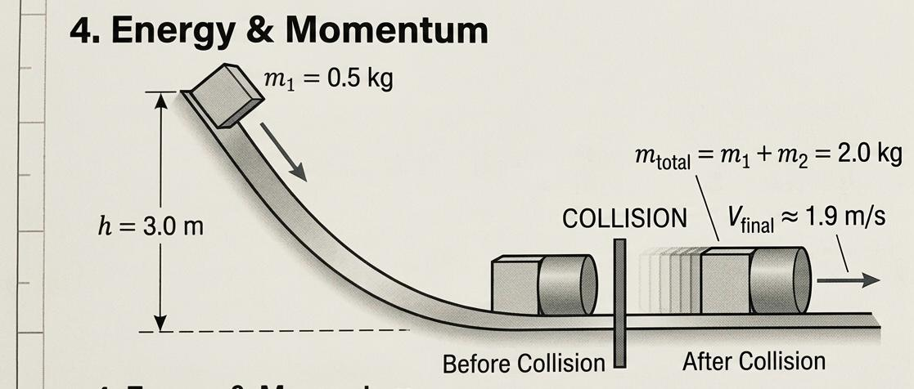

# Task 04 – Energy & Momentum: Inelastic Collision

## Problem Statement

A $0.5\text{ kg}$ block slides down a frictionless track from a height of $3.0\text{ m}$. At the bottom, it collides and sticks to a $1.5\text{ kg}$ block, which is initially at rest. What is the speed of the combined mass just after the collision?

## Theory

This problem involves two distinct phases:
1. **Conservation of Energy**:Since the track is frictionless and as the first block slides down, potential energy ($U$) is converted into kinetic energy ($K$).
2. **Conservation of Momentum**: During the collision, the two blocks stick together (perfectly inelastic collision). Momentum ($p$) is conserved, but kinetic energy is not.

The velocity $v_1$ at the bottom of the track is found via:
$$
m_1 g h = \frac{1}{2} m_1 v_1^2 
$$
$$
v_1 = \sqrt{2gh} 
$$

The conservation of momentum for the collision is:
$$
m_1 v_1 + m_2 v_2 = (m_1 + m_2) V_{final}
$$

## Step-by-Step Solution

### 1. Velocity Before Collision

Calculate the speed of the $0.5\text{ kg}$ block at the bottom of the $3.0\text{ m}$ track:

$$
v_1 = \sqrt{2gh} = \sqrt{2 \cdot 9.81 \cdot 3.0}
$$

$$
v_1 = \sqrt{58.86} \approx 7.672\text{ m/s}
$$

### 2. Collision Phase

Using conservation of momentum, where $m_1 = 0.5\text{ kg}$, $m_2 = 1.5\text{ kg}$, and $v_2 = 0$:

$$
0.5 \cdot 7.672 + 1.5 \cdot 0 = (0.5 + 1.5) V_{final}
$$

$$
3.836 = 2.0 \cdot V_{final}
$$

$$
V_{final} = \frac{3.836}{2.0} = 1.918\text{ m/s}
$$

## Final Result

The speed of the combined mass immediately after the collision is $1.92\text{ m/s}$.

## Interpretation

The velocity decreases significantly after the collision because the mass of the system increases fourfold ($0.5\text{ kg}$ to $2.0\text{ kg}$). Since momentum must be shared with a much heavier stationary object, the final velocity is exactly one-quarter of the initial velocity ($7.672 / 4 = 1.918$).
