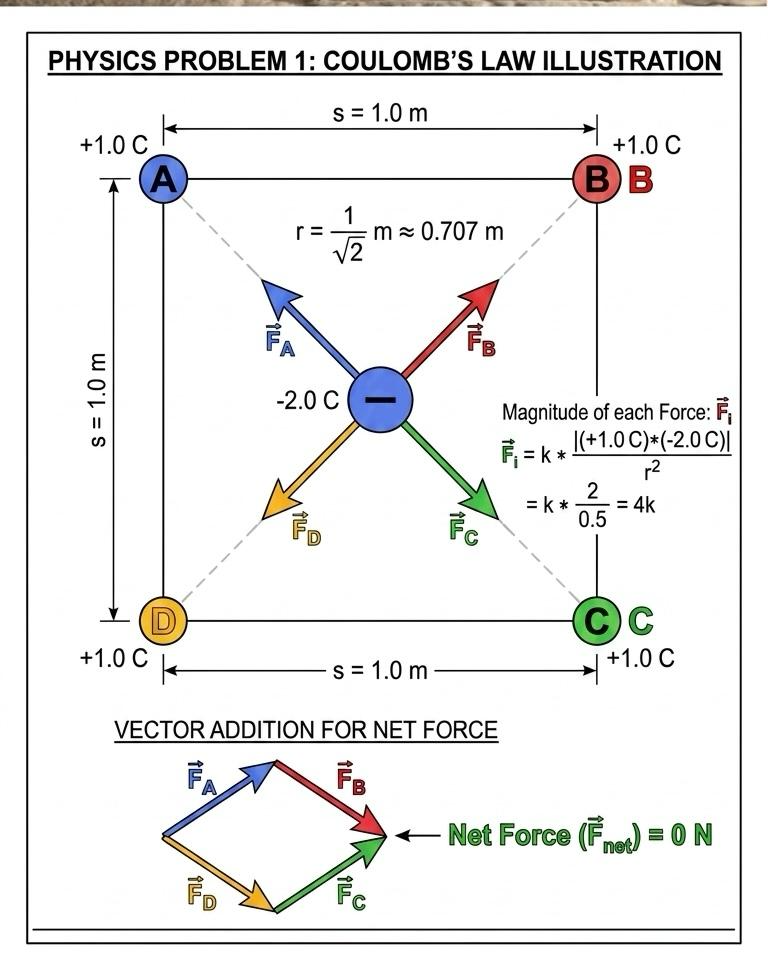

# Task 01 – Coulomb's Law in a Square Configuration

## Problem Statement

Four point charges of $+1.0$ C each are placed at the corners of a square with sides of $1.0$ m. Calculate the magnitude and direction of the electric force on a charge of $-2.0$ C placed at the center of the square.

## Theory

The force between two point charges is governed by **Coulomb's Law**:

$$
F = k \frac{|q_1 q_2|}{r^2}
$$

where $k \approx 8.99 \times 10^9$ $\text{N}\cdot\text{m}^2/\text{C}^2$ is Coulomb's constant.

According to the **Principle of Superposition**, the net force $\vec{F}_{net}$ on a test charge is the vector sum of the individual forces exerted by all other charges in the system:

$$
\vec{F}_{net} = \sum \vec{F}_i
$$

In a symmetrical arrangement, forces may cancel out depending on the signs and magnitudes of the charges.

## Step-by-Step Solution

### 1. Geometric Analysis
Place the square in a coordinate system with the center at the origin $(0,0)$. The corners are located at a distance $r$ from the center.

The diagonal of a square with side $a = 1.0$ m is $d = a\sqrt{2}$. The distance from any corner to the center is half the diagonal:

$$
r = \frac{a\sqrt{2}}{2} = \frac{1.0 \cdot \sqrt{2}}{2} = \frac{\sqrt{2}}{2} \text{ m}
$$

The square of the distance is:

$$
r^2 = \left( \frac{\sqrt{2}}{2} \right)^2 = \frac{2}{4} = 0.5 \text{ m}^2
$$

### 2. Force Magnitudes
Each of the four corner charges $q = +1.0$ C exerts an attractive force on the center charge $Q = -2.0$ C (since they have opposite signs). The magnitude of the force from one corner is:

$$
F_i = k \frac{|(1.0)(-2.0)|}{0.5} = k \frac{2.0}{0.5} = 4k
$$

### 3. Vector Summation
Let the corners be labeled $A, B, C, D$ in order.
- Charge at $A$ pulls the center charge toward $A$.
- Charge at $C$ (opposite to $A$) pulls the center charge toward $C$.

Because the charges at $A$ and $C$ are identical ($+1.0$ C) and equidistant from the center, the force vectors $\vec{F}_A$ and $\vec{F}_C$ have equal magnitude but point in exactly opposite directions.

$$
\vec{F}_A + \vec{F}_C = 0
$$

The same logic applies to the other diagonal (corners $B$ and $D$):

$$
\vec{F}_B + \vec{F}_D = 0
$$

The total net force is:

$$
\vec{F}_{net} = (\vec{F}_A + \vec{F}_C) + (\vec{F}_B + \vec{F}_D) = 0 + 0 = 0
$$

## Final Result

The magnitude of the net electric force is:

$$
F_{net} = 0 \text{ N}
$$

The direction is undefined as the force is zero.

## Interpretation

In a highly symmetrical system where identical charges are placed at the vertices of a regular polygon, the electric field and the resulting force on a charge placed at the geometric center will always be zero. The attractive "pulls" from each corner perfectly balance each other out.

