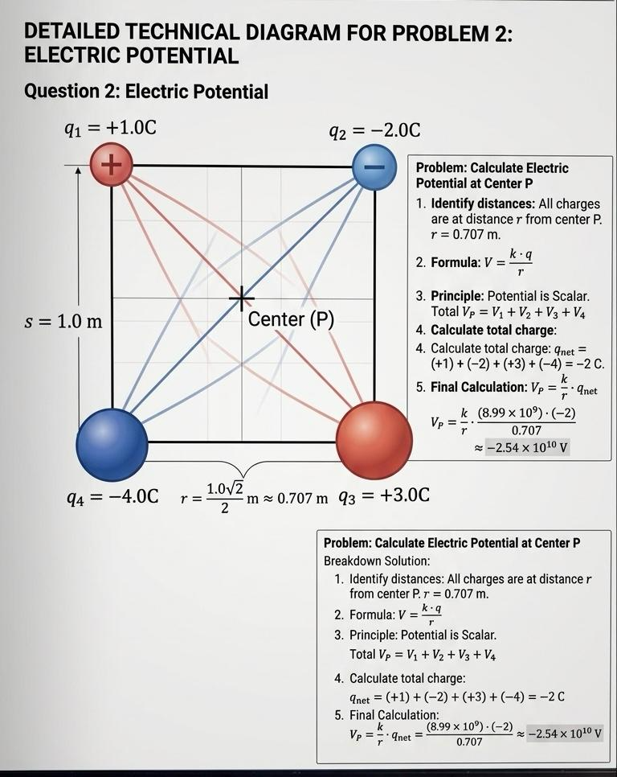

# Task 02 – Electric Potential of a Point Charge System

## Problem Statement

Point charges of $+1$ C, $-2$ C, $+3$ C, and $-4$ C are placed at the corners of a square with sides of $1.0$ m (in order). Calculate the electric potential at the center of the square.

## Theory

The electric potential $V$ at a distance $r$ from a point charge $q$ is a **scalar** quantity given by:

$$
V = k \frac{q}{r}
$$

For a system of multiple charges, the total potential is the algebraic sum of the potentials created by each charge:

$$
V_{total} = \sum V_i = k \sum \frac{q_i}{r_i}
$$

Unlike force or electric field, potential does not involve vectors; we simply add the values while keeping their signs.

## Step-by-Step Solution

### 1. Distance to Center
As calculated in Task 01, for a square of side $a = 1.0$ m, the distance $r$ from each corner to the center is:

$$
r = \frac{\sqrt{2}}{2} \text{ m}
$$

### 2. Summing the Potentials
Since $r$  and $k$ is the same for all four charges, we can factor $k$ and $r$ out of the summation:

$$
V_{center} = \frac{k}{r} (q_1 + q_2 + q_3 + q_4)
$$

Substitute the given charges:
- $q_1 = +1$ C
- $q_2 = -2$ C
- $q_3 = +3$ C
- $q_4 = -4$ C

$$
\sum q = 1 - 2 + 3 - 4 = -2 \text{ C}
$$

### 3. Final Calculation
Substitute $k \approx 8.99 \times 10^9$ $\text{V}\cdot\text{m}/\text{C}$ and $r = \frac{\sqrt{2}}{2}$:

$$
V_{center} = \frac{k}{\frac{\sqrt{2}}{2}} (-2) = \frac{2k}{\sqrt{2}} (-2) = -2\sqrt{2}k
$$

Using $k \approx 8.99 \times 10^9$:

$$
V_{center} \approx -2 \cdot 1.414 \cdot 8.99 \times 10^9 \approx -2.54 \times 10^{10} \text{ V}
$$

## Final Result

The electric potential at the center is:

$$
V_{center} = -2\sqrt{2}k \approx -2.54 \times 10^{10} \text{ V}
$$

## Interpretation

The negative result indicates that the "negative" work required to bring a positive test charge from infinity to this point is greater than the positive work, due to the net negative charge of the configuration. Even though the geometry is symmetric, the potential is non-zero because the charge magnitudes differ.

