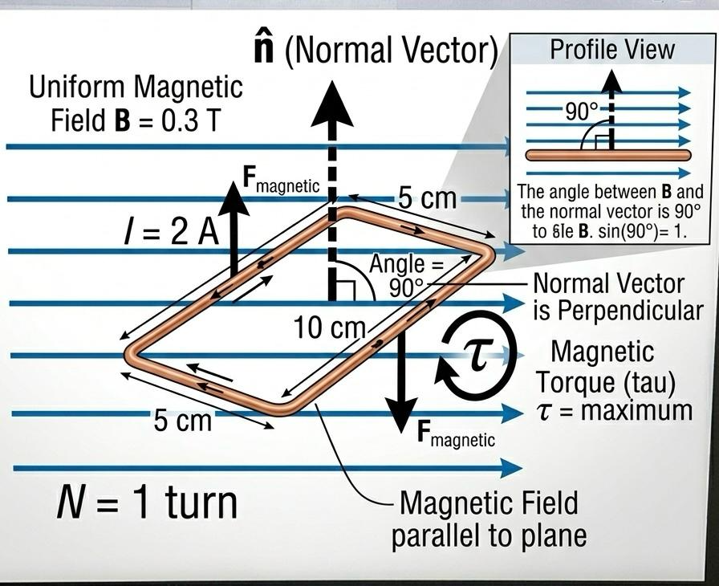

# Task 04 – Magnetic Torque

## Problem Statement

A rectangular loop of wire with dimensions ($10 \text{ cm}  by 5 \text{ cm}$) carries a current of $I = 2 \text{ A}$. A uniform magnetic field $B = 0.3 \text{ T}$ is applied parallel to the plane of the loop. Calculate the magnitude of the magnetic torque $\tau$.

## Theory

The torque $\tau$ exerted on a current-carrying loop in a uniform magnetic field is given by:

$$
\tau = N I A B \sin \theta
$$

Where:
- $N$ is the number of turns (here $N=1$).
- $I$ is the current.
- $A$ is the area of the loop.
- $B$ is the magnetic field strength.
- $\theta$ is the angle between the magnetic field $\mathbf{B}$ and the **normal** vector.

## Step-by-Step Solution

### 1. Calculate the Area
$$
A = 0.1 \text{ m} \times 0.05 \text{ m} = 0.005 \text{ m}^2
$$

### 2. Determine the Angle $\theta$
The problem states the magnetic field is **parallel to the plane** of the loop. 
Since the normal vector is perpendicular to the plane, the angle between the normal and the field is:

$$
\theta = 90^\circ \implies \sin(90^\circ) = 1
$$

### 3. Calculate Torque
$$
\tau = 1 \times 2 \times 0.005 \times 0.3 \times 1
$$

$$
\tau = 0.01 \times 0.3 = 0.003 \text{ N} \cdot \text{m}
$$

## Final Result

The magnitude of the magnetic torque is:

$$
\tau = 3 \times 10^{-3} \text{ N} \cdot \text{m}
$$

## Interpretation

The torque is at its maximum value when the field is parallel to the loop's plane (meaning the magnetic moment is perpendicular to the field). This torque will act to rotate the loop until its plane is perpendicular to the magnetic field.

