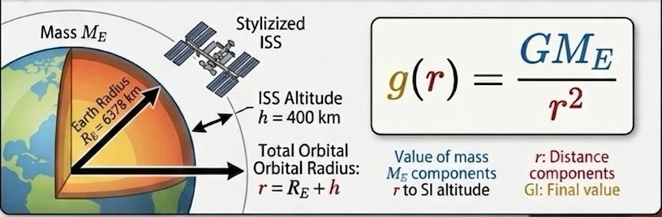

# Task 03 – Microgravity

## Problem Statement

What is the acceleration due to gravity ($g$) at the altitude of the International Space Station (400 km)? Explain why astronauts experience a state of complete "weightlessness" despite the presence of this gravitational field.

## Theory

Newton's law of universal gravitation establishes that the gravitational acceleration $g(r)$ experienced by an object at a distance $r$ from the center of a mass $M_E$ is given by

$$
g(r) = \frac{G M_E}{r^2}
$$

At the surface of the Earth where $r = R_E$, this acceleration is defined as standard surface gravity $g_0 \approx 9.81\,\text{m/s}^2$. At an altitude $h$, the local gravitational acceleration can be expressed relative to the total radius

$$
g(h) = \frac{G M_E}{(R_E + h)^2}
$$

## Step-by-Step Solution

### 1. Calculation of Gravity at ISS Altitude

The constants required for calculation match the standard Earth system parameters

$$
G = 6.6743 \times 10^{-11}\,\text{m}^3\,\text{kg}^{-1}\,\text{s}^{-2}
$$

$$
M_E = 5.97 \times 10^{24}\,\text{kg}
$$

$$
R_E = 6378\,\text{km},\quad h = 400\,\text{km} \implies r = R_E + h = 6778\,\text{km} = 6.778 \times 10^6\,\text{m}
$$

Substitute the physical dimensions into the field equation

$$
g(h) = \frac{6.6743 \times 10^{-11} \times 5.97 \times 10^{24}}{(6.778 \times 10^6)^2}
$$

Compute the terms systematically

$$
g(h) = \frac{3.98456 \times 10^{14}}{4.59413 \times 10^{13}} \approx 8.673\,\text{m/s}^2
$$

## Final Result

The acceleration due to gravity at the altitude of the ISS is approximately $8.67\,\text{m/s}^2$. 

## Interpretation

The calculation reveals that gravity at 400 km altitude is only slightly weaker than gravity on the ground.

The ship, the astronauts, and everything inside are trapped in a continuous, endless fall around the planet.Because the Earth is a sphere, the surface continuously curves away. The spaceship moves sideways so fast that as it falls, With nothing to push back against them, they experience complete weightlessness.

